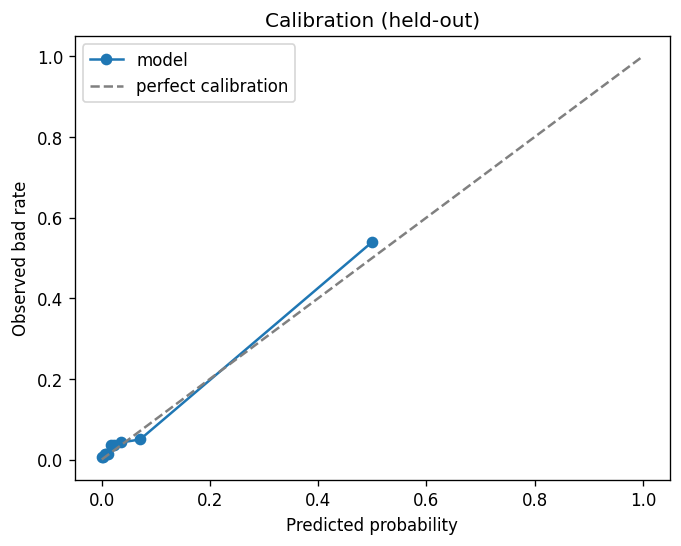
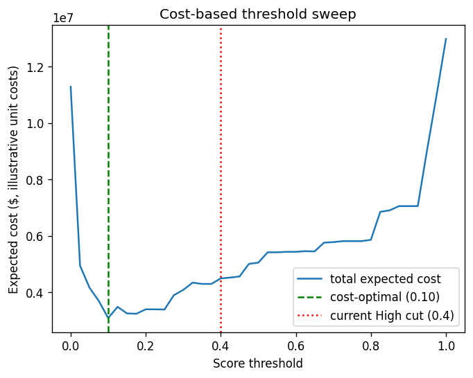
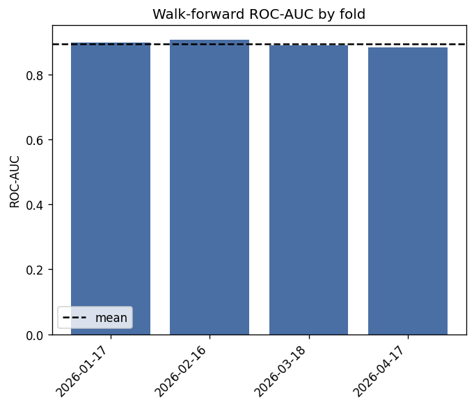
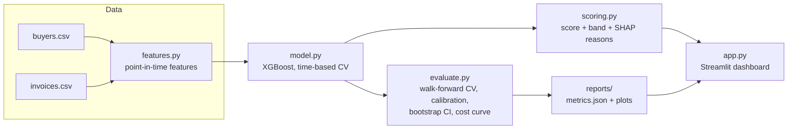

# Buyer Credit Risk: B2B Receivables

[](https://github.com/BugHuntre/b2b-credit-risk-scoring/actions/workflows/ci.yml)


Scores every buyer on the probability of severe payment delinquency (>60 days late, or unpaid) in
the next 90 days, explains the score with SHAP reason codes, ranks buyers by dollar exposure at
risk, and recommends a credit action. Built for B2B sellers on invoiced terms — the motivating
case is an apparel exporter/wholesaler deciding who to extend credit to and who to chase first.

**[Read the model card](docs/MODEL_CARD.md)** for training data, evaluation methodology, and
known limitations. **[Read the notebook](notebooks/01_eda_and_model_development.ipynb)** for the
full EDA-to-model-comparison walkthrough with plots.

## Why this exists

Small and mid-sized exporters extend credit on trust and a credit limit set once, rarely
revisited. Warning signs (a buyer's payments slipping from 5 to 45 days late over a few months)
go unnoticed until an invoice is badly overdue and hard to recover, and collection effort gets
spread evenly instead of toward the buyers where the most money is actually at risk. This project
turns invoice-history data a business already has into an early-warning score, an explanation,
and a prioritised action list — at zero licensing cost.

## Results (on synthetic data — see caveat below)

| Metric | Model | Baseline (avg days late) |
|---|---|---|
| ROC-AUC (time-based hold-out) | **0.89** | 0.84 |
| PR-AUC | **0.72** | 0.61 |
| Walk-forward ROC-AUC, 4 folds | 0.895 ± 0.010 | — |
| Bad buyers caught in the riskiest 20% | 78% | — |

Bad rate observed out-of-sample by risk band: **Low 2.5% → Medium 30% → High 87%** — monotonic and
well separated.

<p>
  
  
  
</p>

> **These numbers are on data generated by `creditrisk/generate.py`, not a real portfolio.** The
> dataset is built to have realistic shape (lateness clustering, a minority of buyers
> deteriorating, disputes correlating with risk), but it exists to demonstrate the pipeline and
> its evaluation methodology — not to claim real-world accuracy. Re-run `train.py --report` on
> real invoice data before trusting any number here. See the [model card](docs/MODEL_CARD.md) for
> the full discussion.

## Quickstart

```bash
git clone https://github.com/BugHuntre/b2b-credit-risk-scoring.git
cd b2b-credit-risk-scoring
pip install -e ".[dev]"

python train.py --report   # generates sample data on first run, trains, writes reports/
streamlit run app.py        # dashboard at localhost:8501

pytest                       # 19 tests, 97% coverage on creditrisk/
```

## Architecture



- **[creditrisk/features.py](creditrisk/features.py)** — per-buyer features as of a date (lateness
  trend, overdue share, utilisation, disputes...), computed only from information known by that
  date. Leakage is checked in `tests/test_features.py::test_no_lookahead`.
- **[creditrisk/model.py](creditrisk/model.py)** — monthly snapshots, label = severe delinquency
  in the next 90 days, XGBoost, time-based hold-out with a gap so labels can't leak across the
  split.
- **[creditrisk/scoring.py](creditrisk/scoring.py)** — 0–100 score, Low/Medium/High band, SHAP
  reason codes, suggested credit limit and action.
- **[creditrisk/evaluate.py](creditrisk/evaluate.py)** — the heavier evaluation used for
  `train.py --report`: expanding-window walk-forward CV, a bootstrap confidence interval,
  calibration, and a cost-based threshold sweep.
- **[creditrisk/config.py](creditrisk/config.py)** — every tunable assumption (label horizon,
  band cut-offs, illustrative unit costs, model hyperparameters) in one place.
- **[app.py](app.py)** — the dashboard: portfolio overview, a filterable watchlist, per-buyer
  drill-down, and a model-quality tab.

## Use your own data

Upload two CSVs in the app's sidebar, or replace the files in `data/`:

| `buyers.csv` | `invoices.csv` |
|---|---|
| `buyer_id`, `buyer_name`, `country`, `segment`, `onboarded_date`, `credit_limit`, `payment_terms_days` | `invoice_id`, `buyer_id`, `invoice_date`, `due_date`, `amount`, `paid_date` (blank = unpaid), `disputed` (0/1) |

You need roughly 18+ months of invoice history for the model to have enough resolved outcomes to
train on (`ValueError` at training time otherwise). The model retrains on whatever you upload —
nothing is hardcoded to the synthetic data's shape.

## Development

```bash
pip install -e ".[dev]"
ruff check .              # lint
mypy creditrisk           # type check
pytest --cov=creditrisk   # tests + coverage
```

CI ([.github/workflows/ci.yml](.github/workflows/ci.yml)) runs all three plus a full
`train.py` smoke test on Python 3.10 and 3.12 for every push and PR to `main`.

## Project layout

```
creditrisk/       core package: config, features, model, scoring, evaluate, io, generate
tests/            pytest unit + integration tests (leakage checks, label logic, cost curve, ...)
notebooks/        EDA and model-development walkthrough
docs/MODEL_CARD.md  intended use, evaluation detail, limitations
train.py          CLI: fit the model, optionally produce the full evaluation report
app.py            Streamlit dashboard
reports/          generated metrics + plots (committed here as an example on synthetic data)
```

## License

[MIT](LICENSE)
